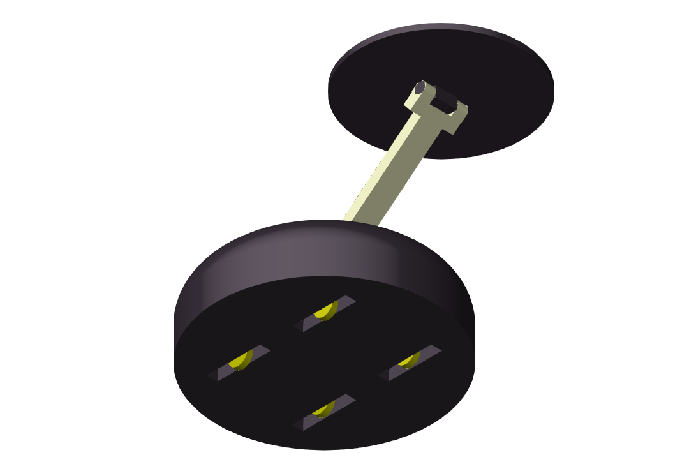
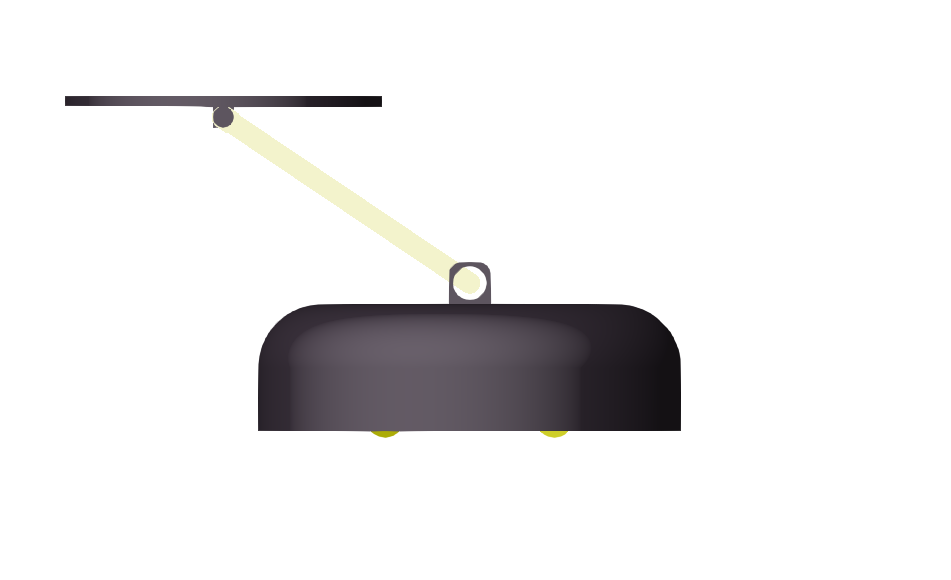
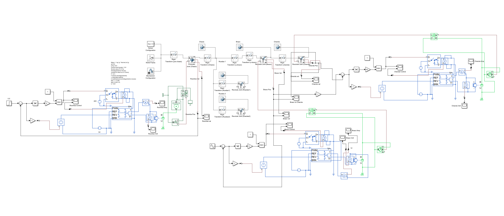
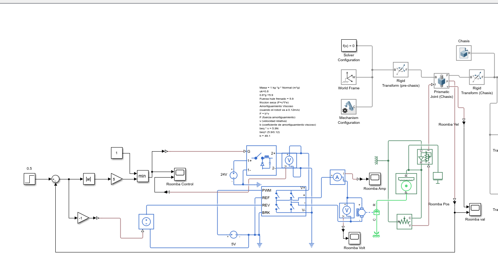
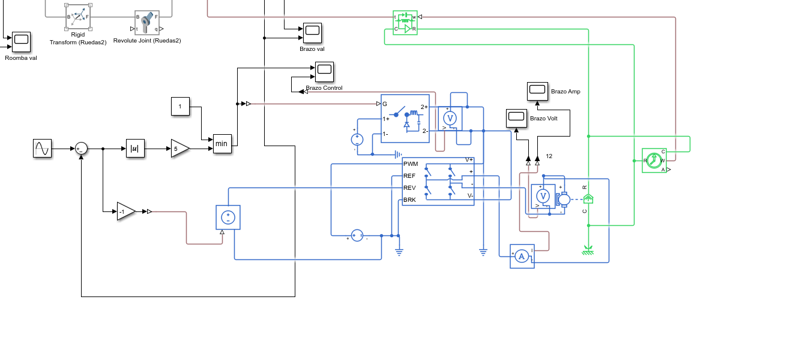
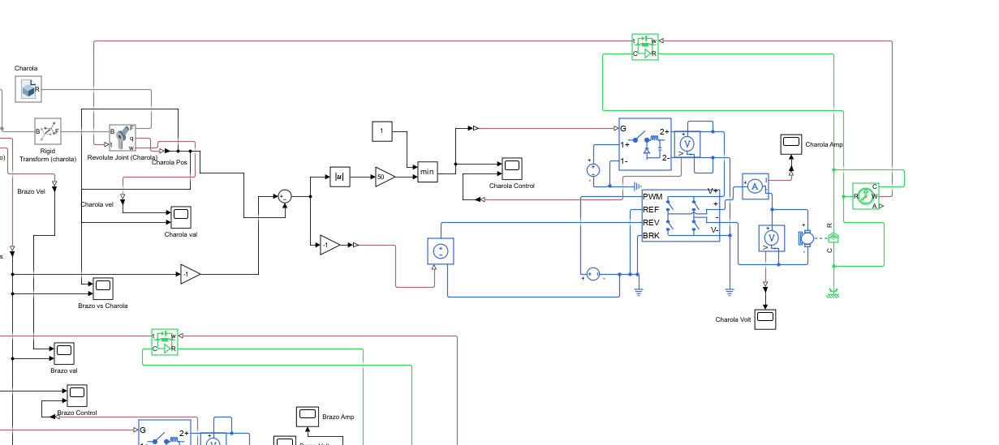

# Robot mesero autoequilibrado

Diseño y simulación de un robot móvil de servicio con una charola capaz de compensar la inclinación de su brazo y mantenerse nivelada.

El proyecto integra el diseño mecánico de las piezas, el modelado multicuerpo, los actuadores eléctricos y el control en lazo cerrado. Todas las piezas mecánicas incluidas fueron modeladas en FreeCAD y exportadas a formato STEP.

## Vista general

  
  

El mecanismo está compuesto por:

- Chasis móvil con cuatro ruedas.
- Brazo articulado para elevar la charola.
- Charola con una articulación independiente para conservar la horizontal.

## Tecnologías

- **FreeCAD:** modelado 3D de chasis, ruedas, brazo y charola.
- **Simscape Multibody:** cuerpos rígidos, transformaciones y articulaciones del mecanismo.
- **Simscape Electrical:** motores de corriente directa, puentes H y medición de variables eléctricas.
- **Simulink:** control de posición del chasis, movimiento del brazo y nivelación de la charola.

## Modelo de control

La simulación utiliza tres lazos de control independientes:

1. Control de posición del chasis.
2. Control de la trayectoria angular del brazo.
3. Control de nivelación de la charola a partir del ángulo relativo entre el brazo y la charola.

El objetivo del tercer lazo es que la charola conserve una orientación horizontal mientras el brazo cambia de posición.

## Modelo de Simulink

  

### Subsistemas principales

  

  

  

## Archivos

| Archivo | Descripción |
| --- | --- |
| `simscape3GDLfuncional.slx` | Modelo de Simscape Multibody, Simscape Electrical y Simulink. |
| `Chasis2.step` | Geometría STEP del chasis. |
| `Ruedas.step` | Geometría STEP de las ruedas. |
| `Brazo.step` | Geometría STEP del brazo articulado. |
| `Charola.step` | Geometría STEP de la charola. |
| `assets/` | Capturas del ensamble y del modelo de simulación. |

## Ejecución

Requisitos:

- MATLAB con Simulink.
- Simscape Multibody.
- Simscape Electrical.

1. Abre `simscape3GDLfuncional.slx` en MATLAB.
2. Ejecuta el modelo desde Simulink.
3. Revisa las señales de posición, ángulo, voltaje y corriente en los scopes.

## Alcance

Este repositorio corresponde al diseño y la simulación de un prototipo académico. Su objetivo es demostrar competencias en diseño CAD, modelado mecatrónico, accionamientos eléctricos y control automático.
